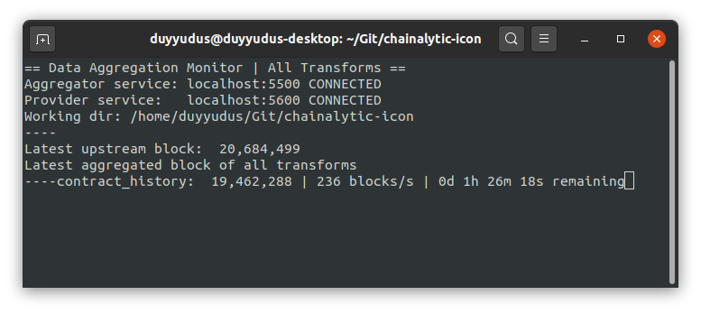

## Chainalytic ICON

A simpler, better, and more efficient version of `chainalytic-framework` dedicated for ICON blockchain networks.

`chainalytic-framework` is now deprecated and should be used only for reference and study. +
For production, you should go with this `chainalytic-icon`

In layman term, `chainalytic-icon` is the engine for aggregating, transforming, and building new data from blockchain transactions ( also known as `transition functions` ) +
It runs in form of a "node" ( a bit similar to blockchain node ), with each `data transform` has its own block height and kept in sync with one `upstream` blockchain node belong to some network ( e.g. citizen node )

Note that, it is neither analytic framework nor platform, its main purpose is data source backend for other applications, include analytic platforms.

### Provider API Reference

link:API.adoc[Provider API]

## Standalone usage

### Install dependencies ( Ubuntu 20.04 )
[source]
----
sudo apt update
sudo apt install python3-pip libsecp256k1-dev libleveldb-dev pkg-config build-essential
----

### Init config
[source]
----
./launch -i
----

### Start data build process
[source]
----
./launch
----

### Run monitor
[source]
----
./launch m
----

_Console monitoring looks like this_

### Run individual services ( for debugging )

[source]
----
venv/bin/python -m chainalytic_icon.aggregator --endpoint localhost:5500 --working_dir .
venv/bin/python -m chainalytic_icon.provider --endpoint localhost:5600 --working_dir .
----

## Production Docker `chainalytic-icon` node

_Just clone `sample_docker_deploy` folder in this repo and edit from there_

### Step 1

Go to your cloned `sample_docker_deploy` folder which will contain `chainalytic-icon` node database, then edit `docker-compose.yml` like below

[source]
----
version: '3'
services:
  chainalytic-icon:
    image: duyyudus/chainalytic-icon
    container_name: chainalytic-icon
    volumes:
      - /path/to/data/mainnet:/mainnet # Modify this, or skip if not using fast mode `direct_db_access` in `config.yml`
      - ./.chainalytic_icon:/chainalytic_icon/.chainalytic_icon
    ports:
      - 5500:5500
      - 5600:5600
----

### Step 2

Edit `.chainalytic_icon/cfg/config.yml` content, usually just need to edit `citizen_node_endpoint` and `direct_db_access`

[source]
----
network_name: 'icon_mainnet'

citizen_node_endpoint: 'https://ctz.solidwallet.io' # Just feel free to choose your favorite citizen node

aggregator_endpoint: '0.0.0.0:5500'
provider_endpoint: '0.0.0.0:5600'

chain_db_dir: '/mainnet/.storage/db_CHANGEIP:7100_icon_dex'
score_db_icondex_dir: '/mainnet/.score_data/db/icon_dex'

# 1 for fast reading data from leveldb, 0 for fetching block data from citizen node
direct_db_access: 1

transforms:
  - contract_history

storage_dir: '.chainalytic_icon/{network_name}/db'

transform_storage_dir: '{storage_dir}/{transform_id}_storage'
transform_cache_dir: '{storage_dir}/{transform_id}_cache'

log_dir: '.chainalytic_icon/{network_name}/log'

# 10: DEBUG
# 20: INFO
# 30: WARNING
# 40: ERROR
# 50: CRITICAL
log_level: 30
----

### Step 3

Run Docker compose

`docker-compose up -d`
